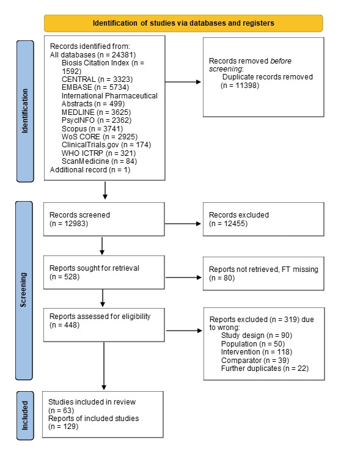
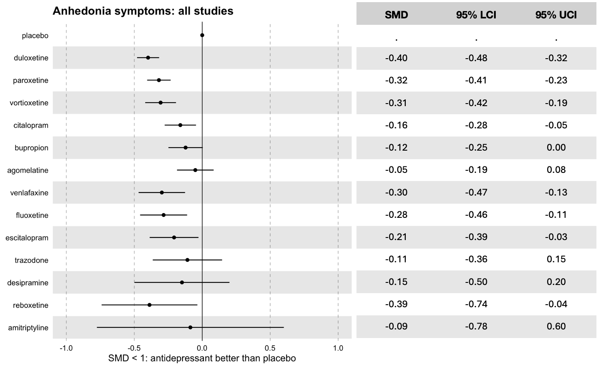
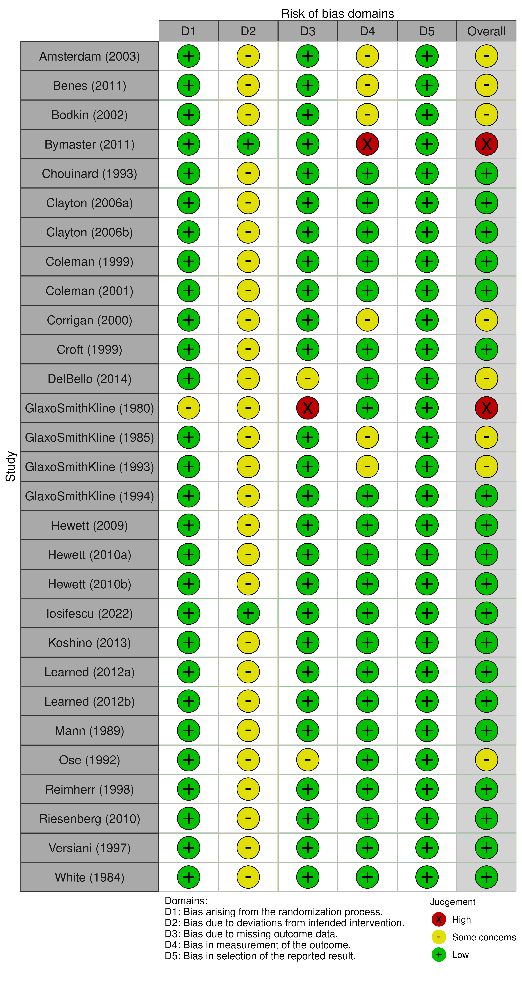
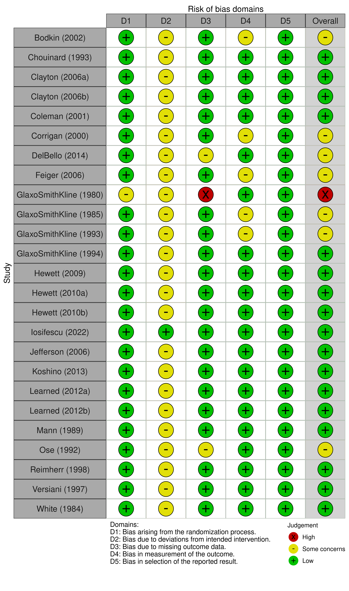
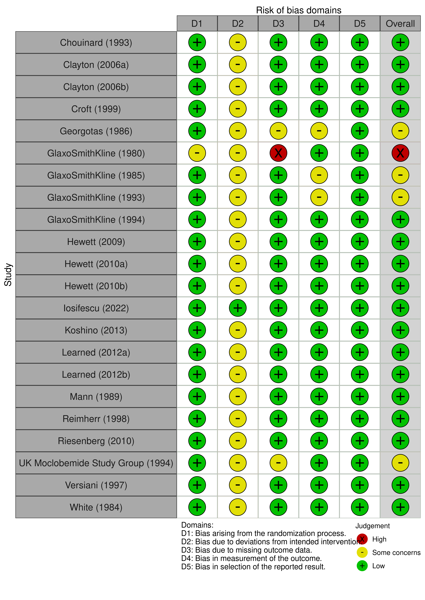
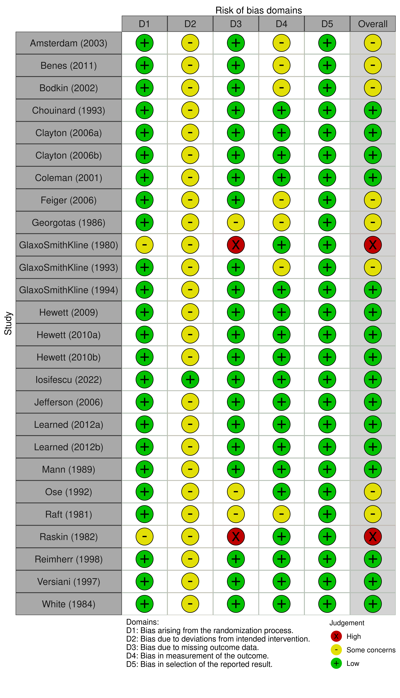
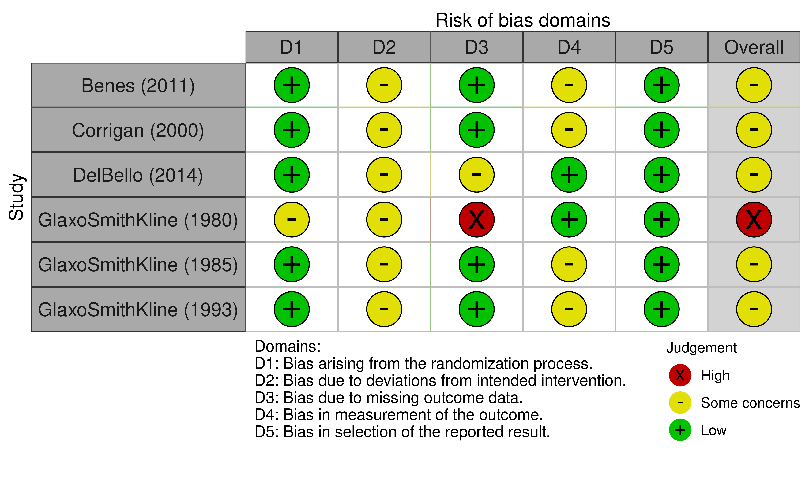

```{r echo = F, include = F, warning = F}
source('util/analysis02 for markdown.R')
all.studies <- unique(c(pwma.acc$studlab,
                        pwma.anhedonia$studlab, 
                        pwma.anxiety$studlab, 
                        pwma.constipation$studlab, 
                        pwma.dizziness$studlab, 
                        pwma.dry_mouth$studlab, 
                        pwma.headache$studlab, 
                        pwma.insomnia$studlab, 
                        pwma.nausea$studlab, 
                        pwma.tol$studlab, 
                        pwma.vomiting$studlab))
all.participants <- sum(df$n_randomised[df$studlab %in% all.studies], na.rm = T)
knitr::opts_chunk$set(echo = T)
options(scipen=100, digits=4)
```

# 1. Methods (brief)

In this first iteration of the living systematic review we searched for randomised controlled trials that compared pro-dopaminergic interventions to placebo in adults with unipolar depression (i.e. above-threshold symptoms on any standardised measure, or a clinical diagnosis based on any operationalised criteria).

Eight databases were searched from inception up to the 9th of November, 2023 (see [protocol](https://wellcomeopenresearch.org/articles/8-425 "Pro-dopaminergic pharmacological interventions for anhedonia in depression: protocol for a living systematic review of human and non-human studies") for full search strings).
Database search results were imported into [EPPI-Reviewer](https://eppi.ioe.ac.uk/cms/Default.aspx?tabid=2914 "EPPI-Reviewer") and duplicates were removed prior to screening.
All steps related to record screening and data extraction were completed in [EPPI-Reviewer](https://eppi.ioe.ac.uk/cms/Default.aspx?tabid=2914 "EPPI-Reviewer").

Titles and abstracts of the identified records were screened by at least two reviewers (CF, MC, JK, JP).
We retrieved the full-texts and any supporting documents for all records that were not excluded at the title and abstract screening stage.
The full-text screening was conducted by at least two reviewers (CF, JK, JP, AK, EB).
Conflicts at title and abstract, and full-text screening, were resolved through discussion between the two reviewers and involvement of a third reviewer (AC, EGO).

We focused on the following outcomes: - anhedonia symptom severity: using anhedonia-specific scales, anhedonia-specific sub-scales, or individual items focusing on anhedonia (observer-rated or self-rated).
Continuous, primary outcome.
- anxiety symptom severity: as per observer or self-reported standardised scales.
Continuous, secondary outcome.
- acceptability: proportion of participants dropping out for any reason.
Binary, secondary outcome.
- tolerability: the proportion of participants dropping out due to an adverse event.
Binary, secondary outcome.
- safety: the proportion of participants reporting specific adverse events (nausea, headache, insomnia, constipation, dizziness, dry mouth, vomiting).
Binary, secondary outcome.

Additional information on the full study eligibility criteria can be found in the pre-published [protocol](https://wellcomeopenresearch.org/articles/8-425 "Pro-dopaminergic pharmacological interventions for anhedonia in depression: protocol for a living systematic review of human and non-human studies").

For anhedonia and anxiety symptom severity, we extracted outcome data reported at 8 weeks post-treatment or manipulation.
If the information at 8 weeks was not available, we considered eligible data ranging between 4 and 12 weeks (with preference to the time point closest to 8 weeks and, if equidistant, the longer outcome).
For acceptability, tolerability, safety and safety (specific adverse events), we extracted outcome data reported at the end of the studies.

When extracting continuous outcomes we extracted mean and standard deviation to two decimal places.
Where standard error was reported, we converted the value to standard deviation.
Baseline and endpoint values were extracted.
These were preferred to change in score and endpoint, in which case the missing value was calculated by adding or subtracting the change in score from the time point given.

When extracting dichotomous outcomes we extracted natural numbers and where only percentages of participant groups were reported, a value was calculated and rounded up to the nearest natural number.
Adverse events were extracted using the exact wording used to report them in the included studies.

Relevant data was extracted using [EPPI-Reviewer](https://eppi.ioe.ac.uk/cms/Default.aspx?tabid=2914 "EPPI-Reviewer") by at least two reviewers (CF, CA, EB, JK).
EPPI-Reviewer was used to screen records, extract data, and assess risk of bias.

We assessed risk of bias with the RoB2 tool (Higgins et al. 2019).
All outcomes for all included studies were assessed by at least two reviewers (JK, CF, CA, AH) and conflicts were resolved by discussion between reviewers.
To evaluate biases due to missing evidence, the ROB-ME tool (Page et al. 2023) was used with the same double screening and conflict resolution process as described above.

Effect sizes were calculated as standardised mean differences (SMDs) for continuous outcomes (anhedonia and anxiety symptom severity) and odds ratios (ORs) for dichotomous outcomes (acceptability, tolerability, and specific-adverse events).
We calculated the 95% confidence interval (CI) around the pooled effect size for each meta-analysis.

Meta-analyses were conducted using a random effects model with the inverse variance method, using the restricted maximum-likelihood estimator for 𝞽^2^ and the Hartung-Knapp correction method to adjust 95% confidence intervals, if there are at least five studies.
Prediction intervals of the overall pooled effect were calculated to convey the amount of heterogeneity.

In order to better contextualise pro-dopaminergic interventions within wider literature on the effects of antidepressants on anhedonia, we aggregated individual participant data (IPD) on the MADRS "inability to feel" item from 34 randomised controlled trials (14054 participants) on antidepressants in people with depression that we had access to.
We utilised this post-hoc analysis to add further evidence on the impact of non-dopaminergic intervantions on anhedonia in depression and in doing so, better understand the evidence we analysed on dopamine-specific drugs.
We performed the following analyses to estimate the performance of bupropion versus placebo at the primary outcome (i.e. reduction in anhedonia scores):

-   aggregated IPD, all antidepressants and placebo, random effects network meta-analysis.
-   aggregated IPD, bupropion versus placebo, random effects pairwise meta-analysis.
-   combination of aggregated IPD and early studies identified in this living systematic review for which IPD were not available, random effects pairwise meta-analysis.

Meta-regressions were planned for the following variables: mean age of participants, mean anhedonia baseline score, mean anxiety baseline score, sex (proportion of female participants), and planned treatment duration.
Meta-regressions were only conducted for outcomes where data was available from 10 or more studies.

Summary of evidence tables were constructed for all outcomes including a summary of the meta-analytic result, biases within-study, across-study, and due to indirectness.

Please refer to the [protocol](https://wellcomeopenresearch.org/articles/8-425 "Pro-dopaminergic pharmacological interventions for anhedonia in depression: protocol for a living systematic review of human and non-human studies") and the extended data for more details.

A list of abbreviations can be found towards the end of the document.

# 2. Results

## 2.1 Flow diagram



**Figure 1.** PRISMA 2020 flow diagram.
\` **Table 1.** Characteristics of included studies that reported anhedonia scores.
NA = not available.

## 2.2 Description of included studies

We identified `r length(unique(df$studlab))` eligible studies.
The characteristics of the identified studies can be found in **Table 1**.
Data from `r cat(paste0(length(all.studies)))` studies contributed with at least one outcome with quantitative data (total of `r all.participants` participants), which included adults from multiple countries.
The mean age of participants was `r round(mean(df$age_mean, na.rm = T), 1)` years (range `r round(min(df$age_mean, na.rm = T), 0)` to `r round(max(df$age_mean, na.rm = T), 0)` years), with a mean proportion of `r round(mean(df$female_prop, na.rm = T), 2)` female participants (range `r round(min(df$female_prop, na.rm = T), 2)` to `r round(max(df$female_prop, na.rm = T), 2)`).
Included studies allocated the participants to treatment lasting between `r round(min(df$tx_duration, na.rm = T), 1)` to `r round(max(df$tx_duration, na.rm = T), 1)` weeks (median, `r round(median(df$tx_duration, na.rm = T), 1)` weeks).

## 2.3 Primary outcome: reduction in anhedonia scores at 8 weeks (from 4 to 12 weeks)

### 2.3.1 Pairwise meta-analysis

```{r anhedonia_forest, echo=FALSE, fig.width=11, fig.height=4}
forest(pwma.anhedonia, 
       sortvar = seTE, 
       label.e = 'Pro-doparminergic drug', 
       label.c = 'Placebo', 
       label.left = 'Favours drug',
       label.right = "Favours placebo",
       just = 'center',
       smlab = 'Anhedonia \nsymptoms severity',
       col.square = pwma.anhedonia$data$colour,
       prediction = T
       )
```

**Figure 2.** Forest plot for symptoms of anhedonia (primary outcome) comparing pro-dopaminergic interventions vs placebo for individuals with anhedonia at 4-12 weeks (primary timepoint).
SMD: standardised mean difference, 95% CI: 95% confidence intervals, SD: standard deviation.

The effect of pro-dopaminergic drugs versus placebo showed `r ifelse(((pwma.anhedonia$lower.random < 0) & (pwma.anhedonia$upper.random < 0)), 'an effect favouring pro-dopaminergic interventions', ifelse(((pwma.anhedonia$lower.random > 0) & (pwma.anhedonia$upper.random > 0)), 'an effect favouring placebo', 'a comparable effect not excluding the null effect'))` with a SMD of `r round(pwma.anhedonia$TE.random, 3)` (95% CI from `r round(pwma.anhedonia$lower.random, 3)` to `r round(pwma.anhedonia$upper.random, 3)`).
There is some heterogeneity as shown by the 95% prediction interval from `r round(pwma.anhedonia$lower.predict, 3)` to `r round(pwma.anhedonia$upper.predict, 3)`.

### 2.3.2 Risk of bias

{width="65%"}

**Figure 3.** Risk of bias assessment.

Evidence for the efficacy of pro-dopaminergic interventions vs placebo were rated as having a range in their overall risk of bias.
Two studies (33%) were assessed as having 'high' risk of bias due to having 'high' risk of bias in the missing outcome data domain and selection of the reported results domain.
Two studies (33%) had an overall 'moderate' risk of bias rating as they had 'some concerns' in two domain ratings.
The remaining two studies were rated as having a 'low' overall risk of bias.

### 2.3.3 Reporting bias

The extent to which the result was affected by reporting biases was rated as low as per the RoB-ME assessment (Page et al. 2023).
This was as the potential for missing studies across the review was judged to be low.
In addition, none of the included studies were deemed to have generated an eligible result that was not reported, and no studies were judged to be unclear as to whether they generated an eligible result that was not reported.
We made this decision based on the results matrix we generated in step 2 of the RoB-ME tool (Page et al. 2023).

### 2.3.4 Meta-regression analyses

We did not perform any meta-regressions as the total number of studies was below 10.

### 2.3.5 Post-hoc analyses

We had access to individual participant data (IPD) of randomised controlled trials on depression from a NIHR-funded project.
We performed a series of post-hoc analyses on the MADRS "inability to feel" item (aggregated IPD from 34 studies, 14054 participants).

```{r anhedonia_forest_bup, echo=FALSE, fig.width=11, fig.height=4}
forest(pwma.anhedonia.bup, 
       sortvar = seTE, 
       label.e = 'Bupropion', 
       label.c = 'Placebo', 
       label.left = 'Favours bupropion',
       label.right = "Favours placebo",
       smlab = 'Anhedonia symptoms severity',
       col.square = pwma.anhedonia.bup$data$colour,
       prediction = T
       )
```

We conducted network meta-analysis.
**Figure 4** shows the results of each active drug versus placebo.
SMD: standardised mean difference, 95% CI: 95% confidence intervals, SD: standard deviation.



**Figure 5.** Summary SMD for the 'inability to feel' item on the MADRS scale, from indirect and direct evidence (network meta-analysis) of antidepressant versus placebo.
Buproprion is the only pro-dopaminergic drug shown.

The mean effect of bupropion (pro-dopaminergic intervention) versus placebo was -0.12 (SMD, 95% CI from -0.25 to 0.00; 34 studies, 14054 participants).
In comparison, we found effects across non-dopaminergic interventions to range from -0.09 (SMD, 95% CI from -0.19 to 0.08) in agomelatine to -0.50 (SMD, 95% CI from -0.48 to -0.32) in duloxetine.
The range of effects found for bupropion verses non-dopaminergic interventions was 0.28 (SMD, 95%CI from -0.15 to 0.41) to -0.07 (SMD, 95%CI from -0.23 to 0.09).

## 2.4 Secondary outcome: Reduction in mean anxiety score at 8 weeks (from 4 to 12 weeks)

### 2.4.1 Pairwise meta-analysis

```{r anxiety_forest, echo=FALSE, fig.width=11, fig.height=8}
forest(pwma.anxiety2, 
       sortvar = seTE, 
       label.e = 'Pro-doparminergic drug', 
       label.c = 'Placebo', 
       label.left = 'Favours drug',
       label.right = "Favours placebo",
       just = 'center',
       smlab = 'Anxiety \nsymptoms severity',
       col.square = pwma.anxiety2$data$colour,
       prediction = T
)
```

**Figure 6** Forest plot for symptoms of anxiety (secondary outcome) comparing pro-dopaminergic interventions vs placebo for individuals with anxiety at 4-12 weeks (primary timepoint).
SMD: standardised mean difference, 95% CI: 95% confidence intervals, SD: standard deviation.
RIMA: Reversible inhibitors of monoamine oxidase-A, MAOI: monoamine oxidase inhibitors, DRI: dopamine reuptake inhibitor.

### 2.4.2 Risk of Bias

{width="65%"}

**Figure 7.** Risk of bias assessment.

### 2.4.3 Meta-regression analyses

The table below shows which of the covariates could modify the treatment effect of pro-dopaminergic interventions on anxiety symptom severity.

|                                                   |                      SMD                       |                                               95% CI                                               |                  𝞽^2^                  |
|:----------------:|:----------------:|:----------------:|:----------------:|
|                 Unadjusted effect                 |      `r round(pwma.anxiety$TE.random, 3)`      |         `r round(pwma.anxiety$lower.random, 3)` to `r round(pwma.anxiety$upper.random, 3)`         |    `r round(pwma.anxiety$tau2, 2)`     |
|                   **Moderator**                   |                                                |                                             **95% CI**                                             |                **𝞽^2^**                |
|       Anxiety baseline (per point increase)       | `r round(reg.anxiety.anxiety[["beta"]][2], 2)` | `r round(reg.anxiety.anxiety[["ci.lb"]][2], 2)` to `r round(reg.anxiety.anxiety[["ci.ub"]][2], 2)` | `r round(reg.anxiety.anxiety$tau2, 2)` |
|            Age (per 10 year increase)             |   `r round(reg.anxiety.age[["beta"]][2], 2)`   |     `r round(reg.anxiety.age[["ci.lb"]][2], 2)` to `r round(reg.anxiety.age[["ci.ub"]][2], 2)`     |   `r round(reg.anxiety.age$tau2, 2)`   |
| Female proportion (per percentage point increase) | `r round(reg.anxiety.female[["beta"]][2], 2)`  |  `r round(reg.anxiety.female[["ci.lb"]][2], 2)` to `r round(reg.anxiety.female[["ci.ub"]][2], 2)`  | `r round(reg.anxiety.female$tau2, 2)`  |
|      Treatment duration (per week increase)       |   `r round(reg.anxiety.tx[["beta"]][2], 2)`    |      `r round(reg.anxiety.tx[["ci.lb"]][2], 2)` to `r round(reg.anxiety.tx[["ci.ub"]][2], 2)`      |   `r round(reg.anxiety.tx$tau2, 2)`    |

## 2.5 Secondary outcome: Dropouts due to any reason

### 2.5.1 Pairwise meta-analysis

```{r acceptability_forest, echo=FALSE, fig.height=16, fig.width=11}
forest(pwma.acc, 
       sortvar = seTE, 
       label.e = 'Pro-doparminergic drug', 
       label.c = 'Placebo', 
       label.left = 'Favours drug',
       label.right = "Favours placebo",
       smlab = 'Dropout \ndue to any reasons',
       col.square = pwma.acc$data$colour,
       prediction = T
)
```

**Figure 8** Forest plot for dropouts due to any reason for the comparison of pro-dopaminergic interventions vs placebo at 4-12 weeks.
OR: odds ratio, 95% CI: 95% confidence intervals.RIMA: Reversible inhibitors of monoamine oxidase-A, MAOI: monoamine oxidase inhibitors, DRI: dopamine reuptake inhibitor.

### 2.5.2 Risk of bias

{width="65%"}

### 2.5.3 Meta-regression analyses

**Figure 9.** Risk of bias assessment.

The table below shows which of the covariates, if any, explain some of the heterogeneity (𝞽^2^) observed in the effect sizes of the effect of pro-dopaminergic interventions on acceptability.

|                                                   |                       OR                        |                                                95% CI                                                |                𝞽^2^                |
|:-----------------:|:----------------:|:----------------:|:----------------:|
|                 Unadjusted effect                 |      `r round(exp(pwma.acc$TE.random), 3)`      |         `r round(exp(pwma.acc$lower.random), 3)` to `r round(exp(pwma.acc$upper.random), 3)`         |    `r round(pwma.acc$tau2, 2)`     |
|                   **Moderator**                   |                                                 |                                              **95% CI**                                              |              **𝞽^2^**              |
|       Anxiety baseline (per point increase)       | `r round(exp(reg.acc.anxiety[["beta"]][2]), 2)` | `r round(exp(reg.acc.anxiety[["ci.lb"]][2]), 2)` to `r round(exp(reg.acc.anxiety[["ci.ub"]][2]), 2)` | `r round(reg.acc.anxiety$tau2, 2)` |
|            Age (per 10 year increase)             |   `r round(exp(reg.acc.age[["beta"]][2]), 2)`   |     `r round(exp(reg.acc.age[["ci.lb"]][2]), 2)` to `r round(exp(reg.acc.age[["ci.ub"]][2]), 2)`     |   `r round(reg.acc.age$tau2, 2)`   |
| Female proportion (per percentage point increase) | `r round(exp(reg.acc.female[["beta"]][2]), 2)`  |  `r round(exp(reg.acc.female[["ci.lb"]][2]), 2)` to `r round(exp(reg.acc.female[["ci.ub"]][2]), 2)`  | `r round(reg.acc.female$tau2, 2)`  |
|      Treatment duration (per week increase)       |   `r round(exp(reg.acc.tx[["beta"]][2]), 2)`    |      `r round(exp(reg.acc.tx[["ci.lb"]][2]), 2)` to `r round(exp(reg.acc.tx[["ci.ub"]][2]), 2)`      |   `r round(reg.acc.tx$tau2, 2)`    |

The smaller 𝞽^2^ value for anxiety baseline suggests that this variable seem to explain the heterogeneity.

## 2.6 Secondary outcome: dropouts due to side effects

### 2.6.1 Pairwise meta-analysis

```{r tolerability_forest, echo=FALSE, fig.width=11, fig.height=15}

forest(pwma.tol, 
       sortvar = seTE, 
       label.e = 'Pro-doparminergic drug', 
       label.c = 'Placebo', 
       label.left = 'Favours drug',
       label.right = "Favours placebo",
       smlab = 'Dropout \ndue to side effects',
       col.square = pwma.tol$data$colour,
       prediction = T
)
```

**Figure 10** Forest plot for dropouts due to adverse events for the comparison of pro-dopaminergic interventions vs placebo at 4-12 weeks.
OR: odds ratio, 95% CI: 95% confidence intervals.RIMA: Reversible inhibitors of monoamine oxidase-A, MAOI: monoamine oxidase inhibitors, DRI: dopamine reuptake inhibitor.

### 2.6.2 Risk of bias

{width="65%"}

**Figure 11.** Risk of bias assessment.

### 2.6.3 Meta-regression analyses

The table below shows which of the covariates, if any, explain some of the heterogeneity (𝞽^2^) observed in the effect sizes of the effect of pro-dopaminergic interventions on tolerability.

|                                                   |                       OR                        |                                                95% CI                                                |                𝞽^2^                |
|:-----------------:|:----------------:|:----------------:|:----------------:|
|                 Unadjusted effect                 |      `r round(exp(pwma.tol$TE.random), 3)`      |         `r round(exp(pwma.tol$lower.random), 3)` to `r round(exp(pwma.tol$upper.random), 3)`         |    `r round(pwma.tol$tau2, 2)`     |
|                   **Moderator**                   |                                                 |                                              **95% CI**                                              |              **𝞽^2^**              |
|       Anxiety baseline (per point increase)       | `r round(exp(reg.tol.anxiety[["beta"]][2]), 2)` | `r round(exp(reg.tol.anxiety[["ci.lb"]][2]), 2)` to `r round(exp(reg.tol.anxiety[["ci.ub"]][2]), 2)` | `r round(reg.tol.anxiety$tau2, 2)` |
|            Age (per 10 year increase)             |   `r round(exp(reg.tol.age[["beta"]][2]), 2)`   |     `r round(exp(reg.tol.age[["ci.lb"]][2]), 2)` to `r round(exp(reg.tol.age[["ci.ub"]][2]), 2)`     |   `r round(reg.tol.age$tau2, 2)`   |
| Female proportion (per percentage point increase) | `r round(exp(reg.tol.female[["beta"]][2]), 2)`  |  `r round(exp(reg.tol.female[["ci.lb"]][2]), 2)` to `r round(exp(reg.tol.female[["ci.ub"]][2]), 2)`  | `r round(reg.tol.female$tau2, 2)`  |
|      Treatment duration (per week increase)       |   `r round(exp(reg.tol.tx[["beta"]][2]), 2)`    |      `r round(exp(reg.tol.tx[["ci.lb"]][2]), 2)` to `r round(exp(reg.tol.tx[["ci.ub"]][2]), 2)`      |   `r round(reg.tol.tx$tau2, 2)`    |

The smaller 𝞽^2^ values for anxiety baseline and female proportion suggest that these predictors seem to explain the heterogeneity.

## 2.7 Secondary outcome: nausea

### 2.7.1 Pairwise meta-analysis

```{r nausea_forest, echo=FALSE, fig.width=11, fig.height=12}
forest(pwma.nausea, 
       sortvar = seTE, 
       label.e = 'Pro-doparminergic drug', 
       label.c = 'Placebo', 
       label.left = 'Favours drug',
       label.right = "Favours placebo",
       smlab = 'Nausea',
       col.square = pwma.nausea$data$colour,
       prediction = T
)
```

**Figure 12** Forest plot for nausea for the comparison of pro-dopaminergic interventions vs placebo at 4-12 weeks.
OR: odds ratio, 95% CI: 95% confidence intervals.
RIMA: Reversible inhibitors of monoamine oxidase-A, MAOI: monoamine oxidase inhibitors, DRI: dopamine reuptake inhibitor.

### 2.7.2 Risk of bias

{width="65%"}

**Figure 13.** Risk of bias assessment.

### 2.7.3 Meta-regression analyses

The table below shows which of the covariates, if any, explain some of the heterogeneity (𝞽^2^) observed in the effect sizes of the effect of pro-dopaminergic interventions on nausea.

|                                                   |                        OR                         |                                                  95% CI                                                  |                 𝞽^2^                 |
|:-----------------:|:----------------:|:----------------:|:----------------:|
|                 Unadjusted effect                 |     `r round(exp(pwma.nausea$TE.random), 3)`      |        `r round(exp(pwma.nausea$lower.random), 3)` to `r round(exp(pwma.nausea$upper.random), 3)`        |    `r round(pwma.nausea$tau2, 2)`    |
|                   **Moderator**                   |                                                   |                                                **95% CI**                                                |               **𝞽^2^**               |
|            Age (per 10 year increase)             |  `r round(exp(reg.nausea.age[["beta"]][2]), 2)`   |    `r round(exp(reg.nausea.age[["ci.lb"]][2]), 2)` to `r round(exp(reg.nausea.age[["ci.ub"]][2]), 2)`    |  `r round(reg.nausea.age$tau2, 2)`   |
| Female proportion (per percentage point increase) | `r round(exp(reg.nausea.female[["beta"]][2]), 2)` | `r round(exp(reg.nausea.female[["ci.lb"]][2]), 2)` to `r round(exp(reg.nausea.female[["ci.ub"]][2]), 2)` | `r round(reg.nausea.female$tau2, 2)` |
|      Treatment duration (per week increase)       |   `r round(exp(reg.nausea.tx[["beta"]][2]), 2)`   |     `r round(exp(reg.nausea.tx[["ci.lb"]][2]), 2)` to `r round(exp(reg.nausea.tx[["ci.ub"]][2]), 2)`     |   `r round(reg.nausea.tx$tau2, 2)`   |

## 2.8 Secondary outcome: headache

### 2.8.1 Pairwise meta-analysis

```{r headache_forest, echo=FALSE, fig.width=11, fig.height=12}
forest(pwma.headache, 
       sortvar = seTE, 
       label.e = 'Pro-doparminergic drug', 
       label.c = 'Placebo', 
       label.left = 'Favours drug',
       label.right = "Favours placebo",
       smlab = 'Headache',
       col.square = pwma.headache$data$colour,
       prediction = T
)
```

**Figure 14** Forest plot for headaches for the comparison of pro-dopaminergic interventions vs placebo at 4-12 weeks.
OR: odds ratio, 95% CI: 95% confidence intervals.
RIMA: Reversible inhibitors of monoamine oxidase-A, MAOI: monoamine oxidase inhibitors, DRI: dopamine reuptake inhibitor.

### 2.8.2 Risk of bias

{width="65%"}

**Figure 15.** Risk of bias assessment.

### 2.8.3 Meta-regression analyses

The table below shows which of the covariates, if any, could modify the relative treatment effect of pro-dopaminergic interventions on headache.
We did not perform a meta-regression on mean anhedonia and anxiety baseline scores as the total number of studies was below 10.

|                                                   |                         OR                          |                                                    95% CI                                                    |                  𝞽^2^                  |
|:-----------------:|:----------------:|:----------------:|:----------------:|
|                 Unadjusted effect                 |     `r round(exp(pwma.headache$TE.random), 3)`      |        `r round(exp(pwma.headache$lower.random), 3)` to `r round(exp(pwma.headache$upper.random), 3)`        |    `r round(pwma.headache$tau2, 2)`    |
|                   **Moderator**                   |                                                     |                                                  **95% CI**                                                  |                **𝞽^2^**                |
|            Age (per 10 year increase)             |  `r round(exp(reg.headache.age[["beta"]][2]), 2)`   |    `r round(exp(reg.headache.age[["ci.lb"]][2]), 2)` to `r round(exp(reg.headache.age[["ci.ub"]][2]), 2)`    |  `r round(reg.headache.age$tau2, 2)`   |
| Female proportion (per percentage point increase) | `r round(exp(reg.headache.female[["beta"]][2]), 2)` | `r round(exp(reg.headache.female[["ci.lb"]][2]), 2)` to `r round(exp(reg.headache.female[["ci.ub"]][2]), 2)` | `r round(reg.headache.female$tau2, 2)` |
|      Treatment duration (per week increase)       |   `r round(exp(reg.headache.tx[["beta"]][2]), 2)`   |     `r round(exp(reg.headache.tx[["ci.lb"]][2]), 2)` to `r round(exp(reg.headache.tx[["ci.ub"]][2]), 2)`     |   `r round(reg.headache.tx$tau2, 2)`   |

## 2.9 Secondary outcome: insomnia

### 2.9.1 Pairwise meta-analysis

```{r insomnia_forest, echo=FALSE, fig.width=11, fig.height=10}
forest(pwma.insomnia, 
       sortvar = seTE, 
       label.e = 'Pro-doparminergic drug', 
       label.c = 'Placebo', 
       label.left = 'Favours drug',
       label.right = "Favours placebo",
       smlab = 'Insomnia',
       col.square = pwma.insomnia$data$colour,
       prediction = T
)
```

**Figure 16** Forest plot for insomnia for the comparison of pro-dopaminergic interventions vs placebo at 4-12 weeks.
OR: odds ratio, 95% CI: 95% confidence intervals.
RIMA: Reversible inhibitors of monoamine oxidase-A, MAOI: monoamine oxidase inhibitors, DRI: dopamine reuptake inhibitor.

### 2.9.2 Risk of bias

{width="65%"}

**Figure 17.** Risk of bias assessment.

### 2.9.3 Meta-regression analyses

The table below shows which of the covariates, if any, explain some of the heterogeneity (𝞽^2^) observed in the effect sizes of the effect of pro-dopaminergic interventions on insomnia.

|                                                   |                         OR                          |                                                    95% CI                                                    |                  𝞽^2^                  |
|:-----------------:|:----------------:|:----------------:|:----------------:|
|                 Unadjusted effect                 |     `r round(exp(pwma.insomnia$TE.random), 3)`      |        `r round(exp(pwma.insomnia$lower.random), 3)` to `r round(exp(pwma.insomnia$upper.random), 3)`        |    `r round(pwma.insomnia$tau2, 2)`    |
|                   **Moderator**                   |                                                     |                                                  **95% CI**                                                  |                **𝞽^2^**                |
|            Age (per 10 year increase)             |  `r round(exp(reg.insomnia.age[["beta"]][2]), 2)`   |    `r round(exp(reg.insomnia.age[["ci.lb"]][2]), 2)` to `r round(exp(reg.insomnia.age[["ci.ub"]][2]), 2)`    |  `r round(reg.insomnia.age$tau2, 2)`   |
| Female proportion (per percentage point increase) | `r round(exp(reg.insomnia.female[["beta"]][2]), 2)` | `r round(exp(reg.insomnia.female[["ci.lb"]][2]), 2)` to `r round(exp(reg.insomnia.female[["ci.ub"]][2]), 2)` | `r round(reg.insomnia.female$tau2, 2)` |
|      Treatment duration (per week increase)       |   `r round(exp(reg.insomnia.tx[["beta"]][2]), 2)`   |     `r round(exp(reg.insomnia.tx[["ci.lb"]][2]), 2)` to `r round(exp(reg.insomnia.tx[["ci.ub"]][2]), 2)`     |   `r round(reg.insomnia.tx$tau2, 2)`   |

## 2.10 Secondary outcome: constipation

### 2.10.1 Pairwise meta-analysis

```{r constipation_forest, echo=FALSE, fig.width=11, fig.height=9}
forest(pwma.constipation, 
       sortvar = seTE, 
       label.e = 'Pro-doparminergic drug', 
       label.c = 'Placebo', 
       label.left = 'Favours drug',
       label.right = "Favours placebo",
       smlab = 'Constipation',
       col.square = pwma.constipation$data$colour,
       prediction = T
)
```

**Figure 18** Forest plot for constipation for the comparison of pro-dopaminergic interventions vs placebo at 8 (4-12) weeks.
OR: odds ratio, 95% CI: 95% confidence intervals.
RIMA: Reversible inhibitors of monoamine oxidase-A, MAOI: monoamine oxidase inhibitors, DRI: dopamine reuptake inhibitor.

### 2.10.2 Risk of bias

{width="65%"}

**Figure 19.** Risk of bias assessment.

### 2.10.3 Meta-regression analyses

The table below shows which of the covariates, if any, could modify the relative treatment effect of pro-dopaminergic interventions on constipation.

|                                                   |                           OR                            |                                                        95% CI                                                        |                    𝞽^2^                    |
|:-----------------:|:----------------:|:----------------:|:----------------:|
|                 Unadjusted effect                 |     `r round(exp(pwma.constipation$TE.random), 3)`      |        `r round(exp(pwma.constipation$lower.random), 3)` to `r round(exp(pwma.constipation$upper.random), 3)`        |    `r round(pwma.constipation$tau2, 2)`    |
|                   **Moderator**                   |                                                         |                                                      **95% CI**                                                      |                  **𝞽^2^**                  |
|            Age (per 10 year increase)             |  `r round(exp(reg.constipation.age[["beta"]][2]), 2)`   |    `r round(exp(reg.constipation.age[["ci.lb"]][2]), 2)` to `r round(exp(reg.constipation.age[["ci.ub"]][2]), 2)`    |  `r round(reg.constipation.age$tau2, 2)`   |
| Female proportion (per percentage point increase) | `r round(exp(reg.constipation.female[["beta"]][2]), 2)` | `r round(exp(reg.constipation.female[["ci.lb"]][2]), 2)` to `r round(exp(reg.constipation.female[["ci.ub"]][2]), 2)` | `r round(reg.constipation.female$tau2, 2)` |
|      Treatment duration (per week increase)       |   `r round(exp(reg.constipation.tx[["beta"]][2]), 2)`   |     `r round(exp(reg.constipation.tx[["ci.lb"]][2]), 2)` to `r round(exp(reg.constipation.tx[["ci.ub"]][2]), 2)`     |   `r round(reg.constipation.tx$tau2, 2)`   |

## 2.11 Secondary outcome: dizziness

### 2.12.1 Pairwise meta-analysis

```{r dizziness_forest, echo=FALSE, fig.width=11, fig.height=10}
forest(pwma.dizziness, 
       sortvar = seTE, 
       label.e = 'Pro-doparminergic drug', 
       label.c = 'Placebo', 
       label.left = 'Favours drug',
       label.right = "Favours placebo",
       smlab = 'Dizziness',
       col.square = pwma.dizziness$data$colour,
       prediction = T
)
```

**Figure 20** Forest plot for dizziness for the comparison of pro-dopaminergic interventions vs placebo at 8 (4-12) weeks.

OR: odds ratio, 95% CI: 95% confidence intervals.
RIMA: Reversible inhibitors of monoamine oxidase-A, MAOI: monoamine oxidase inhibitors, DRI: dopamine reuptake inhibitor.

### 2.11.2 Risk of bias

{width="65%"}

**Figure 21.** Risk of bias assessment.

### 2.11.3 Meta-regression analyses

The table below shows which of the covariates, if any, explain some of the heterogeneity (𝞽^2^) observed in the effect sizes of the effect of pro-dopaminergic interventions on dizziness.

|                                                   |                          OR                          |                                                     95% CI                                                     |                  𝞽^2^                   |
|:-----------------:|:----------------:|:----------------:|:----------------:|
|                 Unadjusted effect                 |     `r round(exp(pwma.dizziness$TE.random), 3)`      |        `r round(exp(pwma.dizziness$lower.random), 3)` to `r round(exp(pwma.dizziness$upper.random), 3)`        |    `r round(pwma.dizziness$tau2, 2)`    |
|                   **Moderator**                   |                                                      |                                                   **95% CI**                                                   |                **𝞽^2^**                 |
|            Age (per 10 year increase)             |  `r round(exp(reg.dizziness.age[["beta"]][2]), 2)`   |    `r round(exp(reg.dizziness.age[["ci.lb"]][2]), 2)` to `r round(exp(reg.dizziness.age[["ci.ub"]][2]), 2)`    |  `r round(reg.dizziness.age$tau2, 2)`   |
| Female proportion (per percentage point increase) | `r round(exp(reg.dizziness.female[["beta"]][2]), 2)` | `r round(exp(reg.dizziness.female[["ci.lb"]][2]), 2)` to `r round(exp(reg.dizziness.female[["ci.ub"]][2]), 2)` | `r round(reg.dizziness.female$tau2, 2)` |
|      Treatment duration (per week increase)       |   `r round(exp(reg.dizziness.tx[["beta"]][2]), 2)`   |     `r round(exp(reg.dizziness.tx[["ci.lb"]][2]), 2)` to `r round(exp(reg.dizziness.tx[["ci.ub"]][2]), 2)`     |   `r round(reg.dizziness.tx$tau2, 2)`   |

The smaller 𝞽^2^ values for female proportion and treatment duration suggest that these predictors may explain some of the heterogeneity.

## 2.12 Secondary outcome: dry mouth

### 2.12.1 Pairwise meta-analysis

```{r dry_mouth_forest, echo=FALSE, fig.width=11, fig.height=10}
forest(pwma.dry_mouth, 
       sortvar = seTE, 
       label.e = 'Pro-doparminergic drug', 
       label.c = 'Placebo', 
       label.left = 'Favours drug',
       label.right = "Favours placebo",
       smlab = 'Dry mouth',
       col.square = pwma.dry_mouth$data$colour,
       prediction = T
)
```

**Figure 22** Forest plot for dry mouth for the comparison of pro-dopaminergic interventions vs placebo at 4-12 weeks.
OR: odds ratio, 95% CI: 95% confidence intervals.
RIMA: Reversible inhibitors of monoamine oxidase-A, MAOI: monoamine oxidase inhibitors, DRI: dopamine reuptake inhibitor.

### 2.12.2 Risk of bias

{width="65%"}

**Figure 23.** Risk of bias assessment.

### 2.12.3 Meta-regression analyses

The table below shows which of the covariates, if any, explain some of the heterogeneity (𝞽^2^) observed in the effect sizes of the effect of pro-dopaminergic interventions on dry mouth.

|                                                   |                          OR                          |                                                     95% CI                                                     |                  𝞽^2^                   |
|:----------------:|:----------------:|:-----------------:|:----------------:|
|                 Unadjusted effect                 |     `r round(exp(pwma.dry_mouth$TE.random), 3)`      |        `r round(exp(pwma.dry_mouth$lower.random), 3)` to `r round(exp(pwma.dry_mouth$upper.random), 3)`        |    `r round(pwma.dry_mouth$tau2, 2)`    |
|                   **Moderator**                   |                       $\beta$                        |                                                   **95% CI**                                                   |                **𝞽^2^**                 |
|            Age (per 10 year increase)             |  `r round(exp(reg.dry_mouth.age[["beta"]][2]), 2)`   |    `r round(exp(reg.dry_mouth.age[["ci.lb"]][2]), 2)` to `r round(exp(reg.dry_mouth.age[["ci.ub"]][2]), 2)`    |  `r round(reg.dry_mouth.age$tau2, 2)`   |
| Female proportion (per percentage point increase) | `r round(exp(reg.dry_mouth.female[["beta"]][2]), 2)` | `r round(exp(reg.dry_mouth.female[["ci.lb"]][2]), 2)` to `r round(exp(reg.dry_mouth.female[["ci.ub"]][2]), 2)` | `r round(reg.dry_mouth.female$tau2, 2)` |
|      Treatment duration (per week increase)       |   `r round(exp(reg.dry_mouth.tx[["beta"]][2]), 2)`   |     `r round(exp(reg.dry_mouth.tx[["ci.lb"]][2]), 2)` to `r round(exp(reg.dry_mouth.tx[["ci.ub"]][2]), 2)`     |   `r round(reg.dry_mouth.tx$tau2, 2)`   |

The smaller 𝞽^2^ value for female proportion suggests that this predictor seems to explain some of the heterogeneity.

## 2.13 Secondary outcome: vomiting

### 2.13.1 Pairwise meta-analysis

```{r vomiting_forest, echo=FALSE, fig.width=11}
forest(pwma.vomiting, 
       sortvar = seTE, 
       label.e = 'Pro-doparminergic drug', 
       label.c = 'Placebo', 
       label.left = 'Favours drug',
       label.right = "Favours placebo",
       smlab = 'Vomiting',
       col.square = pwma.vomiting$data$colour,
       prediction = T
)
```

**Figure 24** Forest plot for vomiting for the comparison of pro-dopaminergic interventions vs placebo at 4-12 weeks.
OR: odds ratio, 95% CI: 95% confidence intervals.
RIMA: Reversible inhibitors of monoamine oxidase-A, MAOI: monoamine oxidase inhibitors, DRI: dopamine reuptake inhibitor.

### 2.13.2 Risk of bias

{width="65%"}

**Figure 25.** Risk of bias assessment.

### 2.13.3 Meta-regression analyses

We did not perform any meta-regressions as the total number of studies was below 10.

## 2.14 Summary of evidence tables

```{r echo = F}
SoE_Indir <- read_xlsx("data/human/LSR1_H_SOE.xlsx")

knitr::kable(SoE_Indir) %>%
  kable_styling(bootstrap_options = "bordered")
```

# 3. Abbreviations

-   CI: Confidence Interval

-   GALENOS: Global Alliance for Living Evidence on aNxiety depressiOn and pSychosis

-   IPD: Individual Participant Data

-   OR: Odds Ratio

-   N: number of studies

-   n: number of participants

-   NI: No Information

-   SD: Standard Deviation

-   SMD: Standard Mean Difference

-   REML: Restricted Maximum Likelihood

-   RoB2: Risk of Bias 2

-   ROB-ME: Risk of Bias for Missing Evidence

# 4. Software Used

We used R version 4.3.1 (R Core Team 2023) and the following packages; meta (Balduzzi, Rucker, and Schwarzer, 2019); dplyr (Wickham et al. 2023); readxl (Wickham and Bryan, 2023); kableExtra (Zhu, 2024).

# 5. References

-   Higgins, J. P., Savović, J., Page, M. J., Elbers, R. G., & Sterne, J. A.
    (2019).
    Assessing risk of bias in a randomized trial. 
    *Cochrane handbook for systematic reviews of interventions*, 205-228.

-   Page, M. J., Sterne, J. A., Boutron, I., Hróbjartsson, A., Kirkham, J. J., Li, T., ... & Higgins, J. P. (2023).
    ROB-ME: a tool for assessing risk of bias due to missing evidence in systematic reviews with meta-analysis. 
    *bmj*, *383*

# 6 Table of included studies

```{r table_of_characteristics_anhedonia, echo=F, results='asis'}

toc <- read_xlsx("data/human/toc.xlsx")
knitr::kable(toc, escape = F) %>%
  kable_styling(bootstrap_options = "bordered")
```

# 7. Risk of Bias - Missing Evidence Assessment

## 7.1 ROB-ME Matrix Step 1

```{r echo = F}
rob_me1 <- read_xlsx("data/human/LSR1_ROB_ME.xlsx", "Step 1")
knitr::kable(rob_me1) %>%
  kable_styling(bootstrap_options = "bordered")
```

## 7.2 ROB-ME Matrix Step 2

1 = A study result is available for inclusion in the meta-analysis, 2 = no study result is available for inclusion in the meta-analysis, for a reason unrelated to the P value, magnitude or direction of the result, 3 = unclear whether an eligible study result was generated, 4 = no study result is available for inclusion in the meta-analysis, likely because of the P value, magnitude or direction of the result generated, .
= study did not measure outcome based on information provided in the publication or clinical trial report.

```{r echo = F}
rob_me2 <- read_xlsx("data/human/LSR1_ROB_ME.xlsx", "Step 2")
knitr::kable(rob_me2) %>%
  kable_styling(bootstrap_options = "bordered")
```

## 7.3 ROB-ME Step 3 & 4

Scores indicate potential for missing studies in the review (3) and risk of bias due to missing evidence in the meta-analysis, as per the ROB-ME tool, abbreviations indicate answers to signalling questions in the tool algorithm N = no, PN = probably no, PY = probably yes, Y = yes, NA = question not applicable.

```{r echo = F}
rob_me3 <- read_xlsx("data/human/LSR1_ROB_ME.xlsx", "Steps 3 & 4")
knitr::kable(rob_me3, digits = 2) %>%
  kable_styling(bootstrap_options = "bordered")
```
